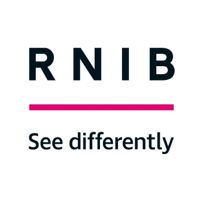

# Collaboration pages for RNIB's Media and Culture Team
RNIB's Media and Culture team are keen to collaborate with industry and academics to help improve accessibility for blind and partially sighted people. We will be using this space to enable discussions and create a repository of useful information.

[Accessible Gaming Report](https://rnib-mediaandculture.github.io/AccessibleGamingReport/)

[RNIB Devkit](https://github.com/RNIB-MediaAndCulture/Gaming_Devkit/blob/main/Devkit.md)

[Other bits](https://raw.githubusercontent.com/RNIB-MediaAndCulture/Gaming_Devkit/refs/heads/Version2/Github%20link%20generator/linkgen.html)
